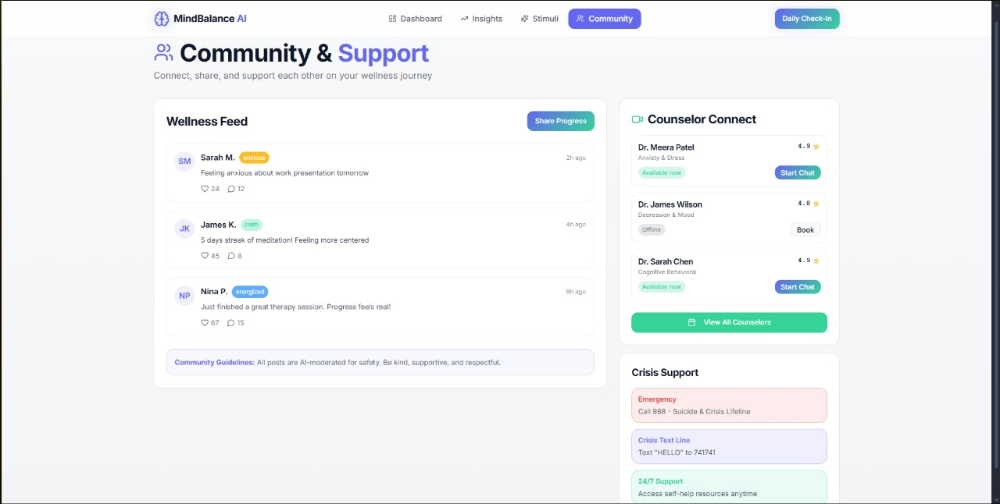

# 🧠 MindBalance-AI  
### _AI-Powered Mental Health Management and Support Platform_

---

## 🌍 Overview
**MindBalance-AI** is an intelligent, empathetic digital companion designed to bridge the global mental health treatment gap.  
It combines **AI-powered emotional understanding**, **data-driven personalization**, and **crisis detection** to support users’ emotional well-being anytime, anywhere.

> 🌎 Over **1 billion** people struggle with mental health issues — MindBalance-AI strives to make support accessible, private, and effective for everyone.

---

## ✨ Key Features
- 🧭 **Mood Tracking Dashboard:** Track emotions and visualize trends over time (7-day & 30-day).  
- 💬 **AI Conversational Assistant:** 24/7 chatbot using OpenAI API to provide empathetic responses.  
- 🧘 **Evidence-Based Interventions:** Includes CBT exercises, mindfulness sessions, and breathing guides.  
- 🚨 **Crisis Detection & Safety Net:** Detects distress signals and connects users to verified helplines instantly.  
- 🧩 **Personalized Coping Engine:** Recommends tailored activities and coping strategies using ML models.  
- 👥 **AI-Moderated Peer Support:** Anonymous community with AI moderation ensuring a safe environment.  
- 🔒 **Privacy & Compliance:** HIPAA/GDPR compliant encryption, anonymized user data, and federated learning.

---

## ⚙️ Tech Stack

| Layer | Technology |
|-------|-------------|
| **Frontend** | React / HTML / CSS / JavaScript |
| **Backend** | Node.js / Flask / Express |
| **Database** | MongoDB / PostgreSQL |
| **AI / NLP** | OpenAI API, TensorFlow, TextBlob, VADER Sentiment |
| **Authentication** | JWT / OAuth 2.0 |
| **Hosting** | AWS / Firebase / Render |
| **Visualization** | Chart.js / D3.js |
| **Security** | AES-256 encryption, TLS 1.3 |

---

## 🚀 Installation & Setup

### 1️⃣ Clone the Repository
```bash
git clone https://github.com/your-username/MindBalance-AI.git
cd MindBalance-AI
```
### 2️⃣ Install Dependencies
```bash
npm install
# OR for Python backend
pip install -r requirements.txt
```
### 3️⃣ Set Environment Variables
Create .env file:
```bash
OPENAI_API_KEY=your_openai_api_key
DATABASE_URL=your_database_url
JWT_SECRET=your_secret_key
```
### 4️⃣ Run the Application
Run the application:
For Node.js-
```bash
npm start
```
For Flask-
```bash
python app.py
```
Visit the app at 👉 http://localhost:3000

---

## 🧪 Demo Features
- Mood Tracker with Analytics
- AI Chatbot with Sentiment Analysis
- Real-time Crisis Keyword Detection
- Personalized Coping Recommendations
- Secure Authentication

---

## 📊 Example Workflow
1. User logs in and records daily mood.
2. AI analyzes emotional tone and detects patterns.
3. Personalized coping exercises are recommended.
4. Crisis detection activates if severe distress appears.
5. Dashboard displays weekly progress trends.

---

## 📸 Screenshots

<p align="center">
  
</p>

<p align="center">
  
</p>

<p align="center">
  
</p>

<p align="center">
  
</p>

---

## 🧩 Future Enhancements
- 🩺 Wearable Integration (stress & sleep tracking)
- 🌐 Multi-language and offline support
- 📞 Video therapy integration with professionals
- 🧠 AI-powered journaling & reflection
- 💬 Group therapy and community events

---

## 📈 Impact Goals
- Reduce untreated population (currently 75% globally).
- Improve user retention from 3.3% → 10%+ via personalization.
- Demonstrate measurable improvement using PHQ-9 & GAD-7 scores.
- Offer 24/7, anonymous, and affordable emotional support.

---

## 🤝 Contributors
This project exists thanks to the collective effort of developers, designers, and researchers who contributed their time, creativity, and expertise to make MindBalance-AI possible.  
Contributions of all kinds — from code and design to documentation and testing — are always welcome!  

If you’d like to contribute:
1. Fork the repository  
2. Create a new branch (`git checkout -b feature/YourFeature`)  
3. Commit your changes (`git commit -m "Add your feature"`)  
4. Push to the branch (`git push origin feature/YourFeature`)  
5. Open a Pull Request 🚀

---

## 🧾 License
This project is licensed under the [MIT License](License) – see the LICENSE
 file for details.

---

## 🌟 Acknowledgments
- OpenAI – Conversational AI integration
- WHO & APA – Mental health frameworks and guidelines
- Hackathon Mentors – Technical and strategic support
- All contributors who believe in tech for emotional well-being 💙

---

## 💬 Tagline
> “Your mental health companion — intelligent, empathetic, and always there.”

---
